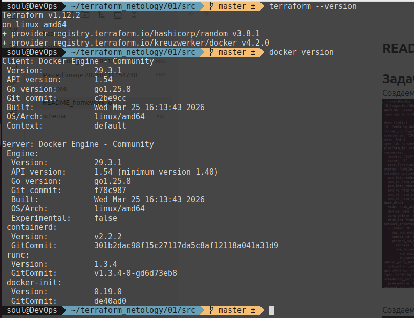
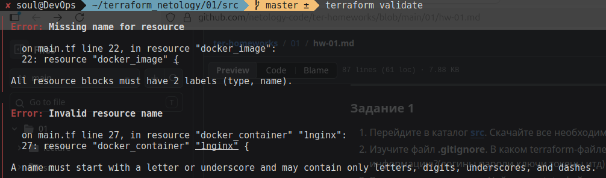

# Чек-лист



# Задание 1

## 1. Зависимости скачаны командой "terraform init"

## 2. файл хранения секретов "personal.auto.tfvars"

## 3. Секретное содержимое созданного ресурса random_password:

![[Pasted image 20260420160415.png]]

4. В чём заключаются намеренно допущенные ошибки:


1 ошибка: Блок resource должен содержать 2 обязательных аргумента "type", "name". В данном случае указан только один ресурс.
2 ошибка: Заключается в том, что наименования ресурсов должны начинаться только с буквы или подчеркивания, в приведенном же случае начинается с цифры.
3 ошибка: Вызов необъявленного ресурса. Ранее был объявлен ресурс только с именем "random_string"
![[Pasted image 20260420212553.png]]
4 ошибка: Заключается в вызове неправильного аргумента "resulT", при наличии только аргумента 'result'
![[Pasted image 20260420213018.png]]

5.  docker ps:
![[Pasted image 20260421093220.png]]

6. Применение terraform apply -auto-approve может быть опасно, так как terraform с таким ключом может удалить элементы критической инфраструктуры, например, сеть или базу данных. Кроме того, отсутствует элемент проверки, т.е. какой plan реально пойдет в работу. При этом состояние облака могло измениться на момент применения. Кроме того, вместо обновления ресурса terraform может пересоздать ресурс, что приведет к простою. 
   terraform apply -auto-approve может пригодиться в автоматических пайплайнах , где нет человека, который выберет yes, в локальной разработке в "песочнице".
   docker ps:
   ![[Pasted image 20260421095345.png]]

7. 
```tfstate
{
  "version": 4,
  "terraform_version": "1.12.2",
  "serial": 16,
  "lineage": "95d11750-ce48-87db-327b-79b62dd80310",
  "outputs": {},
  "resources": [],
  "check_results": null
}
```
8. согласно документации ресурс 'docker image' имеет опциональный аргумент `keep_locally`, типа bool. Если его значение `true`, по при операции `destroy` образ из локального репозитория удлён не будет:
![[Pasted image 20260421105146.png]]

# Задание 2
В задаче сделал создание ресурсов с помощью terraform. И даже сделал подключение провайдера докер удаленное, но terraform apply падает с ошибкой 
```shell
│ Error: Unable to read Docker image into resource: unable to list Docker images: Error response from daemon: client version 1.41 is too old. Minimum supported API version is 1.44, please upgrade your client to a newer version
│
│   with docker_image.mysql_8,
│   on docker.tf line 20, in resource "docker_image" "mysql_8":
│   20: resource "docker_image" "mysql_8" {
```
И победить это не смог. Подозреваю что провайдер docker использует старую версию API, а как поднять более новую не знаю.
