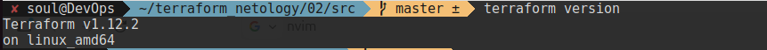
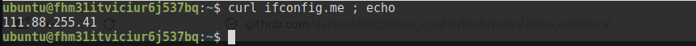
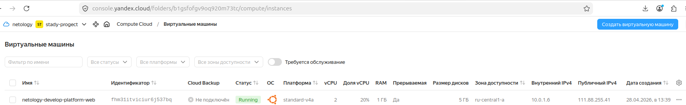
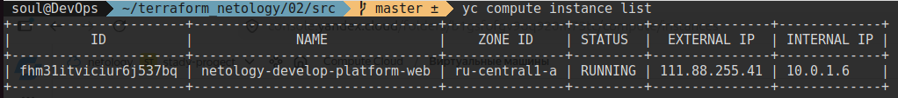
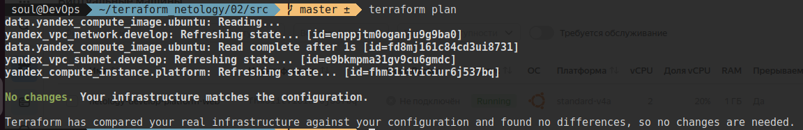
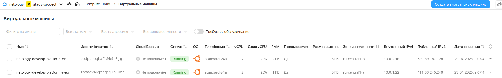
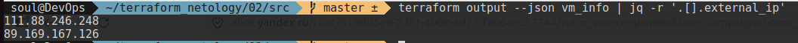

# Задание 1. 
```shell
terraform version
```


4. Ошибок несколько:
	а) опечатка в указании платформы "standart" -> "standard"
	б) Yandex Compute Cloud предоставляет различные виды процессоров. Выбор платформы гарантирует тип физического процессора в дата-центре и определяет набор допустимых конфигураций vCPU и RAM. 
	И среди предлагаемых отсутствует "standard -v4" -> "standard-v4a" [оф.документация](https://yandex.cloud/ru/docs/compute/concepts/vm-platforms)
	в) параметры вычислительных ресурсов, как то количество ядер и уровень их производительности определен в [документации](https://yandex.cloud/ru/docs/compute/concepts/performance-levels), согласно которой для платформы standard-v4a мин.уровень производительности 20%, количество vCPU 2.
5. 



6. preemptible создает прерываемую виртуальную машину. Это такая машина, которая может быть принудительно сотановлена в любой момент. Это бывает в 2 случаях:
	- Если с момента запуска ВМ прошло 24 часа
	- Если возникает нехватка ресурсов для запуска обычной ВМ в той же зoне доступности.
	core_fraction параметр отвечающий за уровень производительности. Виртуальные машины с уровнем производительности меньше 100% имеют доступ к вычислительной мощности физических ядер как минимум на протяжении указанного процента от единицы времени.
	В процессе обучения данные параметры позволяют снизить расход средств с биллинг аккаунта.

# Задание 2

# Задание 3


# Задание 4


# Задание 7
```shell
> local.test_list[1]
"staging"
> length(local.test_list)
3
> local.test_map.admin
"John"
>  "${local.test_map.admin} is admin for ${local.test_list[2]} server based on OS ${local.servers.production.image} with ${local.servers.production.cpu} vcpu, ${local.servers.production.ram} ram and ${length(local.servers.production.disks)} virtual disks"
""John is admin for production server based on OS ubuntu-20-04 with 10 vcpu, 40 ram and 4 virtual disks""
```
# Задание 8
Не совсем понял задачу, но сохранил переменную в variabels.tf. Для получения значения ssh:
```shell
> var.test[0].dev1.0
"ssh -o 'StrictHostKeyChecking=no' ubuntu@62.84.124.117"
```