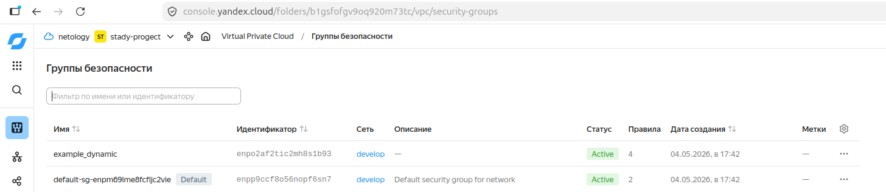
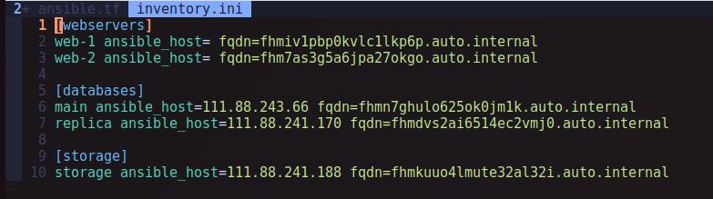

# Задание 1

# Задание 2
выполнено
# Задание 3
выполнено
# Задание 4
Задание написано вообще, лично для меня,очень не понятно. 
Битый час только пытался понять что вообще от меня хотят
При попытке создать ресурсы через count loop (web) постоянно упираешься в ошибку квот, повысить которые не возможно RESOURCE_EXHAUSTED: Quota limitpc.externalAddressesCreation.rate exceeded, поэтому web без ip адреса:


# Задание 5
выполнено
# Задание 6
не выполнено
demonstration2 в репозитории отстуствует
# Задание 7
вероятно решение будет представлять срез для списков до 3 элемента, и от 3 до длины списка:
```hcl
{
  network_id = local.vpc.network_id
  subnet_ids = slice(local.vpc.subnet_ids, 0, 2) + slice(local.vpc.subnet_ids, 3, length(local.vpc.subnet_ids))
  subnet_zones = slice(local.vpc.subnet_zones, 0, 2) + slice(local.vpc.subnet_zones, 3, length(local.vpc.subnet_zones))
}

```
# Задание 8
на самом ошибки 2. Правильный вариант
```hcl
[webservers1]
%{~ for i in webservers ~}
${i["name"]} ansible_host=${i["network_interface"][0]["nat_ip_address"]} platform_id=${i["platform_id"]}
%{~ endfor ~}
```

# Задание 9
не выполнено полностью.  
1:  список до 99
```hcl
locals {
  rc_list_full = [for i in range(1, 100) : format("rc%02d", i)]
}
```