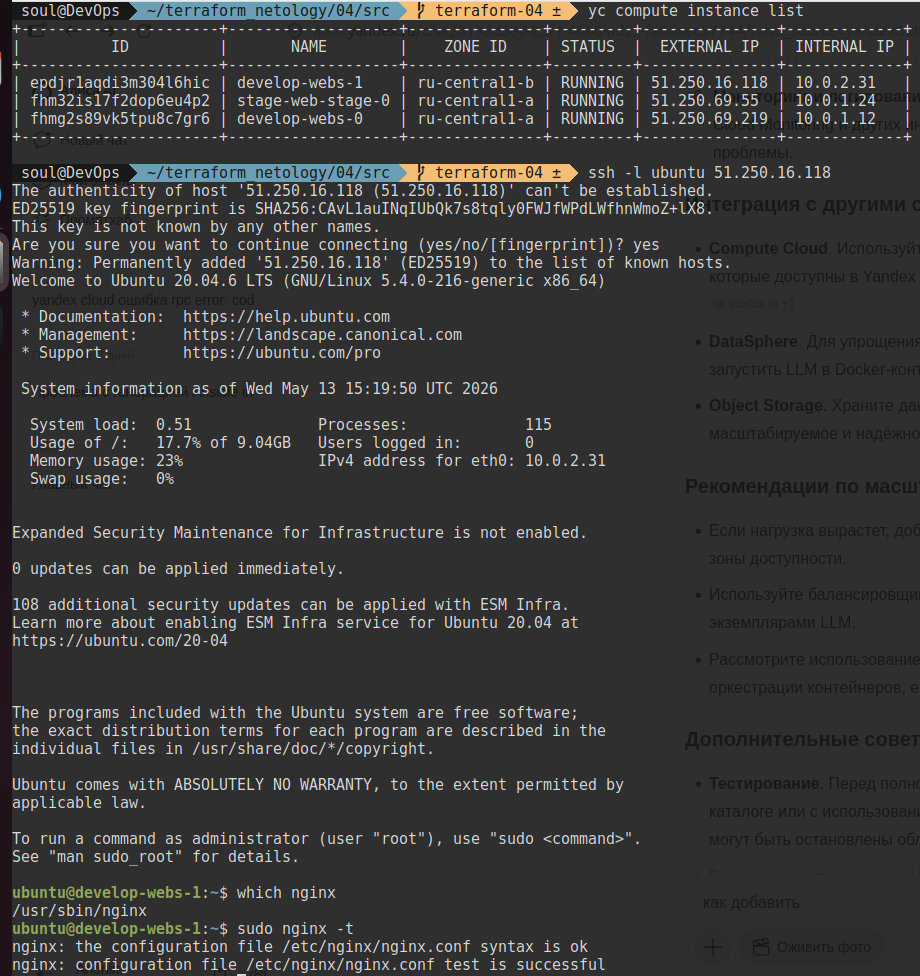

### Задание 1
1. 

![[20260513183043.png]]
![[20260513183241.png]]
Очень длинный вывод, не влезает в один экран, поэтому один модуль и то не весь
![[20260513183534.png]]
![[20260513183850.png]]
### Задание 2
![[20260515010449.png]]

Документация в [[doc]]
### Задание 3

![[20260515012105.png]]
![[20260515012552.png]]
![[20260515013537.png]]
![[20260515014615.png]]
![[20260515014701.png]]
![[20260515015144.png]]
![[20260515015255.png]]

## Дополнительные задания (со звёздочкой*)

Я их выполню, но сейчас отправляю обязательные за нехваткой времени для их выполнения